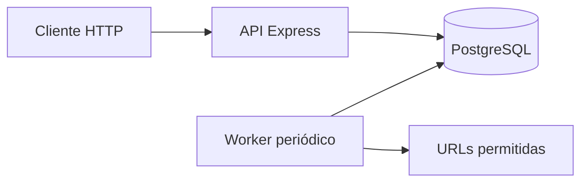

# PulseOps

API de monitorización HTTP. Permite
registrar páginas, comprobar periódicamente su disponibilidad y latencia, y
consultar el último resultado almacenado.

PulseOps separa la API del proceso de comprobación, utiliza PostgreSQL como punto
de coordinación y puede ejecutarse localmente con Docker Compose. El repositorio
también incluye infraestructura AWS con Terraform y un despliegue de un nodo en
k3s.

## Funcionalidades

- Registro y consulta de monitores mediante una API REST.
- Worker independiente con intervalo y timeout configurables.
- Estados `UP` y `DOWN`, código HTTP, latencia y clasificación de errores.
- Persistencia de monitores y resultados en PostgreSQL.
- Política `ALLOWED_HOSTS` para limitar los destinos que puede visitar el worker.
- Una única imagen Docker reutilizada por API y worker.
- Entorno local reproducible con Docker Compose.
- Infraestructura como código para AWS y manifiestos Kubernetes para k3s.
- Pruebas automatizadas de la API, validaciones y comprobaciones HTTP.

## Arquitectura



API y worker son procesos independientes. La API registra y consulta monitores;
el worker obtiene de PostgreSQL los monitores activos, realiza las peticiones y
guarda los resultados. Esta separación permite ejecutar cada proceso en un
contenedor y desplegarlo después como un `Deployment` diferente en Kubernetes.

## Tecnologías

| Área | Tecnologías |
|---|---|
| Backend | JavaScript, Node.js 20, Express 5 |
| Datos | PostgreSQL 16, SQL parametrizado |
| Pruebas | `node:test`, `node:assert`, Fetch API |
| Contenedores | Docker, Docker Compose |
| Infraestructura | Terraform, AWS EC2/VPC |
| Orquestación | Kubernetes, k3s |

## Puesta en marcha local

Requisitos:

- Docker.
- Docker Compose 2.

Crear la configuración local y levantar el entorno completo:

```bash
cp .env.example .env
docker compose up --build --detach
docker compose ps
```

Se inician tres servicios: PostgreSQL, API y worker. La API queda disponible
únicamente en `http://127.0.0.1:8080`; PostgreSQL también se enlaza solo a la
interfaz local.

Comprobar la API:

```bash
curl http://127.0.0.1:8080/health
```

Respuesta esperada:

```json
{"status":"ok"}
```

Registrar una página permitida:

```bash
curl -X POST http://127.0.0.1:8080/monitors \
  -H 'Content-Type: application/json' \
  -d '{"name":"Example","url":"https://example.com"}'
```

Consultar monitores y su último resultado:

```bash
curl http://127.0.0.1:8080/monitors
```

El worker realiza una comprobación inmediatamente y repite la ronda cada 30
segundos. Los datos permanecen después de reiniciar los contenedores porque
PostgreSQL utiliza un volumen Docker.

Para ver los logs o detener el entorno sin borrar los datos:

```bash
docker compose logs --follow api worker database
docker compose down
```

## API

| Método | Ruta | Descripción | Respuestas principales |
|---|---|---|---|
| `GET` | `/health` | Comprueba que el proceso responde | `200` |
| `POST` | `/monitors` | Registra una URL permitida | `201`, `400`, `409` |
| `GET` | `/monitors` | Lista monitores y último resultado | `200` |

Ejemplo de un monitor comprobado:

```json
{
  "id": 1,
  "name": "Example",
  "url": "https://example.com/",
  "enabled": true,
  "createdAt": "2026-09-27T18:00:00.000Z",
  "latestCheck": {
    "status": "UP",
    "httpStatus": 200,
    "latencyMs": 87,
    "errorType": null,
    "errorMessage": null,
    "checkedAt": "2026-09-27T18:00:30.000Z"
  }
}
```

## Pruebas

Las pruebas utilizan un repositorio en memoria, por lo que no necesitan una base
de datos real:

```bash
npm ci
npm test
```

Actualmente se verifican 11 casos: salud, creación, listado, duplicados,
validación de nombres y URLs, respuestas HTTP correctas, timeouts y errores de
red.

## Configuración

| Variable | Valor local predeterminado | Uso |
|---|---|---|
| `DATABASE_URL` | PostgreSQL local | Conexión de API y worker |
| `PORT` | `8080` | Puerto de la API |
| `CHECK_INTERVAL_MS` | `30000` | Tiempo entre rondas |
| `REQUEST_TIMEOUT_MS` | `5000` | Límite de cada petición |
| `ALLOWED_HOSTS` | `example.com,api` | Destinos que se pueden monitorizar |

`.env.example` contiene valores de desarrollo. `.env` está ignorado por Git y
no debe contener credenciales de producción versionadas.

## AWS y k3s

La carpeta `infra/terraform` define una VPC, una subred pública, reglas de acceso
restringidas a una IP, una instancia EC2 y un disco cifrado. La carpeta `k8s`
contiene los objetos para desplegar API, worker y PostgreSQL en k3s.

La definición se ha formateado y validado localmente, pero no se ha ejecutado
`terraform apply` ni se han creado recursos en una cuenta AWS. La guía incluye
el coste estimado, autenticación, plan, despliegue y destrucción:

- [Guía de infraestructura AWS y k3s](docs/aws-k3s.md).

## Estructura del repositorio

```text
src/                API, worker, acceso a datos y validación
test/               Pruebas automatizadas
test-support/       Repositorio en memoria para las pruebas
db/                 Esquema inicial de PostgreSQL
compose.yaml        Entorno local completo
infra/terraform/    Infraestructura AWS
k8s/                Manifiestos Kubernetes
scripts/aws/        Despliegue y diagnóstico remotos
docs/               Documentación técnica paso a paso
```

## Decisiones y límites

- Las consultas SQL utilizan parámetros; los valores no se concatenan en SQL.
- Las URLs deben usar HTTP/HTTPS, no pueden incluir credenciales y su hostname
  debe estar autorizado, reduciendo el riesgo de SSRF.
- El proyecto es un MVP personal: todos los clientes de una instalación ven los
  mismos monitores; no hay autenticación ni gestión de usuarios.
- El despliegue k3s es de un solo nodo, sin alta disponibilidad ni copias de
  seguridad, y está pensado como laboratorio, no como plataforma de producción.
- No se incluye CI/CD; la imagen se construye y transfiere manualmente.

## Documentación

- [Guía paso a paso de la aplicación](docs/guia-paso-a-paso.md).
- [Guía de AWS, Terraform y k3s](docs/aws-k3s.md).
